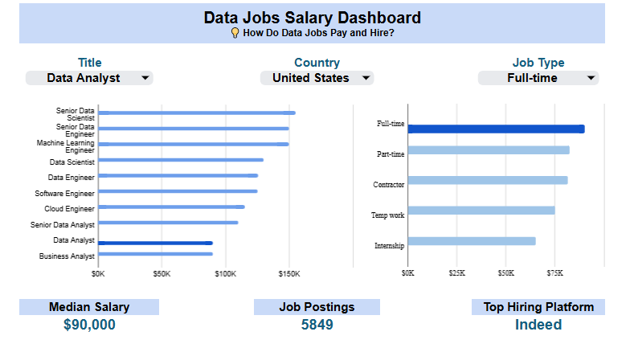

# Data Jobs Market 2023 — Salaries, Skills Demand & Seasonal Trends

Analyzed **32,000+ data job postings** to uncover:
- 💰 Top-paying roles
- 📊 Most in-demand roles & skills
- 📅 Seasonal hiring trends
- 🌍 Top-paying countries
- 🎯 Best-fit roles that balance **high salary** with **fewer required skills**

This project answers key career questions:
- Which data roles are most in demand?
- Which roles pay the highest salaries?
- Do more skills lead to higher pay?
- When is the best time of year to apply?
- Which role offers the best balance of salary and skill requirements?

This project has **two parts**:
1. **Google Sheets Dashboard** — Interactive overview of the data jobs market
2. **Excel Analytics & Presentation** — Deeper salary, demand, skills, and Seasonal hiring trends analysis with final report

---

## 📊 Part 1 — Google Sheets Dashboard
- Built an interactive dashboard in **Google Sheets**
- Cleaned dataset using **Array Functions**
- Delivered quick insights into:
  - Salaries across roles (Analyst, Scientist, Engineer)
  - Hiring platforms distribution
  - Job schedule type: Full-time, Part-time, Contract, etc.
- 📂 Files: [`/part1-google-sheets-dashboard`](./part1-google-sheets-dashboard)
- 🔗 [Google Sheets Dashboard (view link)](https://github.com/MooRahim/analyze-data-job-posts-using-google_sheets-excel/blob/main/part1-google-sheets-dashboard/part1-google-sheets-dashboard.xlsx) 
- 🔗 [Google Sheets (view link)](https://docs.google.com/spreadsheets/d/1d0lBb843t69wLR3iz8jHBaNiHjepm-k1GrgKy26D028/edit?usp=sharing)

---

## 📊 Part 2 — Excel Analytics & Google Slides Report
- Cleaned and transformed dataset with **Power Query, Power Pivot, Pivot Table**
- Built visualizations using **Pivot Charts + DAX**
- Analyzed:
  - Salary distributions by role
  - Data jobs demand distributions by role
  - Data jobs demand distributions by country
  - Skills demand (SQL, Python, Excel, etc.)
  - Best time of year for hiring
- Delivered final **presentation report**
- 📂 Files: [`/part2-excel-analytics`](./part2-excel-analytics)
- 🔗 [Excel Analytics (view link)](https://github.com/MooRahim/analyze-data-job-posts-using-google_sheets-excel/blob/main/part2-excel-analytics/part2-data-jobs-excel-analytics.xlsx) 
- 📑 [Insights Presentation (PDF)](https://github.com/MooRahim/analyze-data-job-posts-using-google_sheets-excel/blob/main/part2-excel-analytics/data-job-market-insights-presentation.pdf)
- 🔗 [Google Slides presentation (view link)](https://docs.google.com/presentation/d/1efkR9teBdNx13HMppql_jqsV2w8bBS1Sl4lFzyDKQPg/edit?usp=sharing)

---

## 📸 Screenshots

<p align="center">
  
</p>

<p align="center">
  
</p>

---

## 📂 Repository Structure

```

├─ part1-google-sheets-dashboard/
│  ├─ dashboards/        # Google Sheets exports
│  ├─ screenshots/       # Dashboard images
│  └─ screen-records/    # Demo video recordings
│
├─ part2-excel-analytics/
│  ├─ dashboards/        # Excel files
│  ├─ presentation/      # Final PDF
│  ├─ charts/            # Data visuals
│  ├─ screenshots/       # Analysis visuals
│  └─ screen-records/    # Demo video recordings
│
├─ reports/
│  ├─ one-pager.md       # 60-second recruiter summary
│  └─ slides.pdf         # Interview slide deck
│
├─ formulas-used.md
├─ README.md
└─ LICENSE

```
---

## 🎯 Key Insights
- Data Analysts in the U.S. earn a **median salary of ~$90K**.  
- **SQL, Python, Tableau, R, and AWS** are the most in-demand skills across all data jobs.  
- **More skills ≠ higher salary** — sometimes the opposite is true.  
- Demand for most data roles peaks in **August (Q3)** and drops in **Q4**.  
- **Indeed** is the top hiring platform.  
- Best-fit roles by career stage:  
  - **Start → Data Analyst**  
  - **Grow → Data Scientist**  
  - **Upgrade → Senior Data Engineer / Senior Data Scientist**

---

## 🛠️ Tools Used
- **Google Sheets** (Array Functions, Pivot Tables, interactive dashboards)  
- **Excel** (Power Query, Power Pivot, Pivot Charts, DAX)  
- **Visualization:** Excel charts, Google Sheets charts  
- **Presentation:** Google Slides, PDF report  

---

## 📄 How to Reproduce
1. Open `/part1-google-sheets-dashboard` → Open the Google Sheets link or `.xlsx` export.  
2. Open `/part2-excel-analytics` → Run the Excel file with Power Query enabled.  
3. Review `/part2-excel-analytics/data-job-market-insights-presentation.pdf` or open the Google Slides link for the final summary.  

---

## 📈 Results & Impact
- Established clear salary benchmarks for 2023 data roles.  
- Identified critical skills to prioritize for career growth.  
- Highlighted the best season to apply for data jobs.  
- Showed best-fit roles for both career starters and professionals looking to upgrade.

---

## 📑 Credits
- Dataset: From Luke Barousse’s Excel course (Data Jobs dataset, 2023)  
- Project inspired by course materials; all analysis and insights are my original work  

---

## 📜 License
MIT License — feel free to use, share, and adapt with attribution.
```
